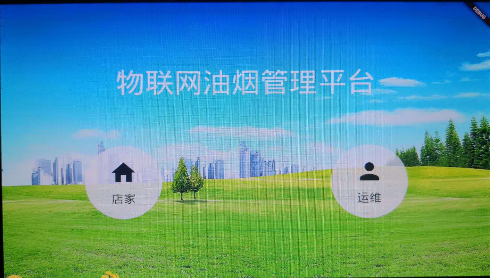
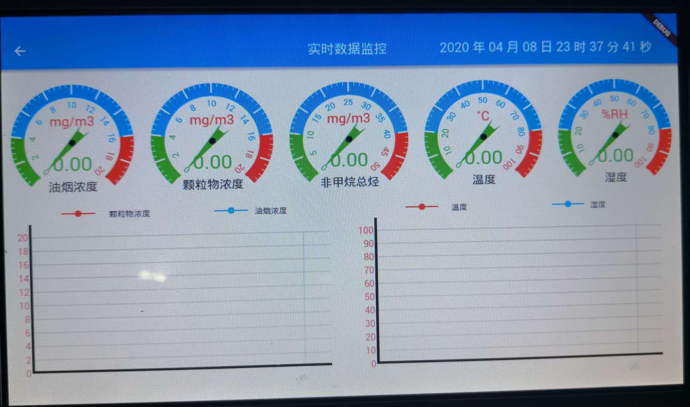
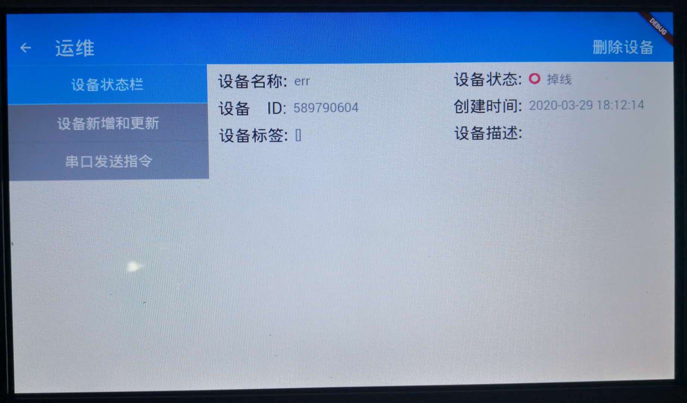
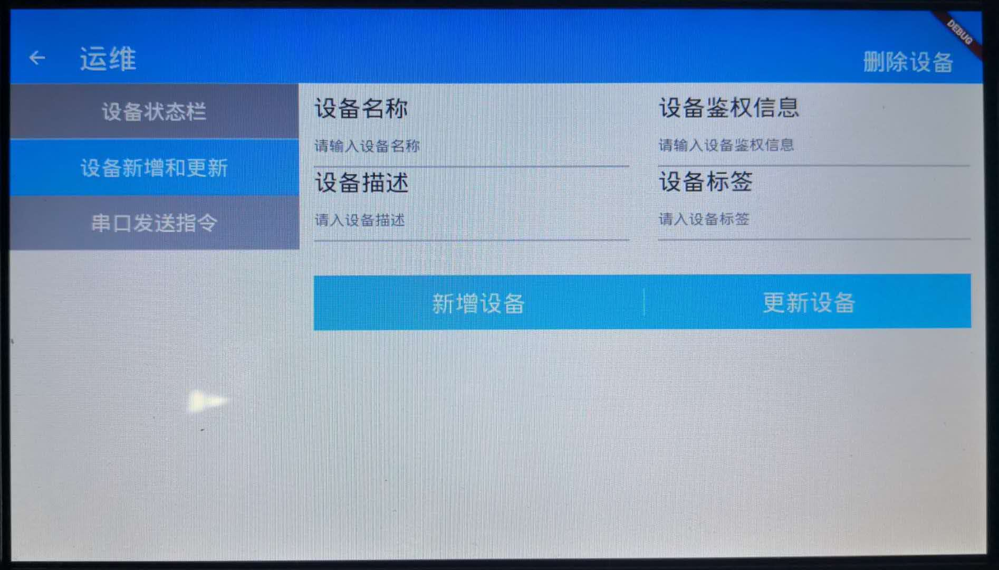
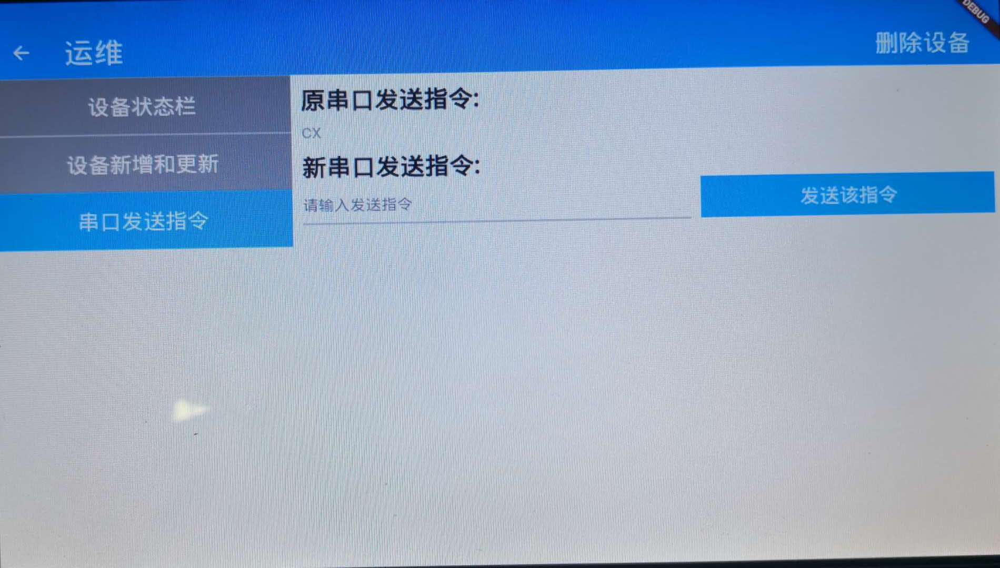

# 油烟机管理平台
这是物联网油烟管理平台，由周双建、曹阿陪开发的项目，该项目的主要界面有：
### 主页

### 仪表盘页

### 设备状态页

### 设备注册和变更页

### 设备发送指令页

如果，你有幸看到该页面，那你应该可能需要该项目的功能和页面。代码已经版权化，如果您真的需要，请联系下面的人。

联系人：
TEL:18801210281（周先生）
TEL:13673461626（曹先生）
